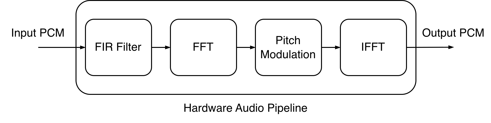
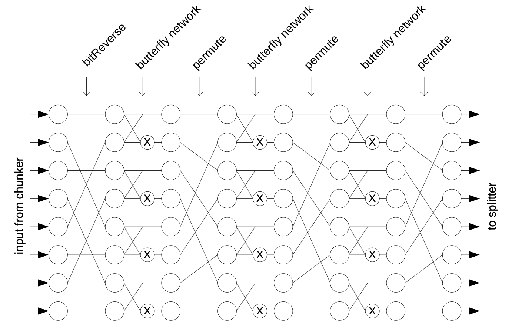

# Lab: 音频处理流水线

在这个Lab中，你将实现一个如下图所示的音频处理流水线，包括有限冲激响应滤波器(FIR filter)、快速傅立叶变换(FFT)、音高调制(pitch modulation)和快速傅立叶逆变换(IFFT)等模块。音频处理流水线除上述四个模块外的其他辅助模块均已实现，你只需要完成这四个模块的设计。



## 项目文件结构

下图是`src`目录下的文件结构。`AudioPipeline.bsv`是音频处理流水线的顶层模块，`AudioProcessorTypes.bsv`定义了音频处理流水线中使用的类型，`AudioPipelineTest.bsv`是流水线测试模块。`fir`、`fft`和`pitch`目录分别包含FIR filter、FFT/IFFT和pitch modulation的实现及其测试文件。`utility`目录包含了一些辅助模块，如Splitter、Chunker等。

``` bash
.
├── AudioPipeline.bsv
├── AudioPipelineTest.bsv
├── AudioProcessorTypes.bsv
├── fft
│   ├── FFT.bsv
│   ├── FFTTest.bsv
│   └── IFFTTest.bsv
├── fir
│   ├── FIRFilter.bsv
│   └── FIRFilterTest.bsv
├── pitch
│   ├── PitchShift.bsv
│   └── PitchShiftTest.bsv
└── utility
    ├── Chunker.bsv
    ├── ComplexMP.bsv
    ├── ConvertComplexMP.bsv
    ├── Cordic.bsv
    ├── Overlayer.bsv
    ├── OverSampler.bsv
    └── Splitter.bsv
```

## 任务说明

你需要完成FIR filter、FFT/IFFT和pitch modulation模块的设计。以下是每个模块的说明：

### FIR Filter

N阶FIR滤波器的定义如下：

$$y[n] = c_0 x[n] + c_1 x[n-1] + \cdots + c_N x[n-N]$$

其中，$x[n]$是输入信号，$y[n]$是输出信号，$\{c_0, c_1, \ldots, c_N\}$是滤波器系数。用硬件实现FIR滤波器时，应当每周期从输入序列获取一个值，输出最近N+1个输入值与滤波器系数的加权和。

需要注意的是，滤波器的系数是Q15.16的定点数(`FixedPoint#(16,16)`)，而输入信号是`Int#(16)`，你可以用`fromInt`函数将`Int#(16)`转换为`FixedPoint#(16,16)`，然后进行定点数的乘法和加法操作。定点数的乘法请使用`fxptMult`函数，累加结果请用`FixedPoint#(32, 32)`保存。最后先用`fxptGetInt`函数将累加结果转换回`Int#(32)`，再用`truncate`函数将其转换为`Int#(16)`。

请将FIR滤波器实现在`src/fir/FIRFilter.bsv`文件的`mkFIRFilter`模块中，滤波器阶数为8阶。**请不要修改滤波器的系数和接口定义。** `mkFIRFilter`使用的接口`AudioProcessor`在`src/AudioProcessorTypes.bsv`中已定义。

### FFT/IFFT

快速傅立叶变换(FFT)是一种高效计算离散傅立叶变换(DFT)的方法，快速傅立叶逆变换(IFFT)是FFT的逆过程。FFT将时域信号转换为频域信号，IFFT则将频域信号转换回时域信号。快速傅立叶变换的算法有多种，在这个Lab中，你需要实现Pease FFT算法。Pease FFT算法的具体说明可以参考[这里](https://www.cs.drexel.edu/tech-reports/DU-MCS-98-01.pdf)。



本次Lab中，你需要实现8点的Pease FFT算法，如上图所示。输入和输出均为8个复数点。算法需要先经过bit reversal，再经过3个stage，每个stage包括butterfly network和permutation。这些运算定义如下：

- Bit reversal: 对数据进行重新排列。重新排列的方式是，将每个输入的索引按位反转，例如第`001`个输入变为第`100`个输出。
- Butterfly network: 将输入数据每两个分为一组，每组进行蝴蝶运算，蝴蝶运算的公式如下：
  $$y_{2 i} = x_{2 i} + W_N^k \cdot x_{2 i + 1}$$
  $$y_{2 i + 1} = x_{2 i} - W_N^k \cdot x_{2 i + 1}$$
  其中，$W_N^k = e^{-j(\pi k / N)}$是旋转因子(twiddle factor)，$N$是FFT的点数，$k = \text{floor}[(2 i)/2^{\log_2(N)-s)}] * 2^{\log_2(N)-s}$，其中s是当前stage的编号，i是当前stage的蝴蝶运算的编号，floor表示向下取整。

  例如，在上图中，N为8，每个stage有4组蝴蝶运算。在第0个stage，所有蝴蝶运算的k均为0；在第1个stage，第0和第1个蝴蝶运算的k为0，第2和第3个蝴蝶运算的k为2，依此类推。
  在`src/fft/FFT.bsv`中，已经用`getTwiddle`函数实现好了twiddle factor的计算，你可以直接调用它来获取第s个stage的第i个蝴蝶运算的twiddle factor。
- Permutation: 对数据进行重新排列，具体的排列方式可以直接参考上图。

FFT的接口在`src/fft/FFT.bsv`已定义：

``` bsv
typedef Server#(
    Vector#(FFT_POINTS, ComplexSample),
    Vector#(FFT_POINTS, ComplexSample)
) FFT;
```
`Server#(req,rsp)`由Bluespec标准库ClientServer定义，包含两个子接口，供外部模块向其发送请求和接收响应：

``` bsv
interface Put request; method Action put(req x); endinterface
interface Get response; method ActionValue#(rsp) get(); endinterface
```

因此，在实现`mkFFT`模块时，你需要实现这两个子接口，例如你可以在模块的最后这样写:

``` bsv
interface Put request;
    method Action put(Vector#(FFT_POINTS, ComplexSample) x);
        inputFIFO.enq(x);
    endmethod
endinterface

interface Get response;
    method ActionValue#(Vector#(FFT_POINTS, ComplexSample)) get();
        return outputFIFO.first();
    endmethod
endinterface
```

IFFT模块的实现与FFT类似，对于相同的输入，IFFT的输出是FFT输出的反序列再除以FFT的点数N。因此你可以直接复用同样的接口，并且在IFFT的实现中调用FFT模块。

将FFT运算实现为一个组合逻辑会导致关键路径延迟过长，因此你需要在适当位置插入寄存器或FIFO，将FFT的计算过程分解为多个stage，实现流水线，如下图所示。


请将FFT和IFFT实现在`src/fft/FFT.bsv`文件的`mkFFT`和`mkIFFT`模块中。

### Pitch Modulation 

频率调制(pitch modulation)是对频域信号的变换。频率移调(pitch shifting)是一种改变音频音高的频率调制技术。在本Lab中，你需要实现一个简单的频率移调模块，移调算法可以参考以下C代码。算法的输入是一个复数向量，代表一帧频谱，输出是一个移调后的复数向量，代表移调后的频谱。对于每一帧输入频谱，需要计算每个频率点与上一帧的相位差，并将该相位差乘以移调因子`PITCH_FACTOR`，累加到输出的相位信息中。最后，将移调后的相位信息和输入频谱的幅度结合，生成移调后的频谱。

```c
#define PITCH_FACTOR 2.0
#define N 8

void pitch_shift(complex double* in, complex double* out)
{
    // 上一帧的相位信息
    static double inphases[N] = {0};
    static double outphases[N] = {0};

    bzero(out, sizeof(complex double) * N);

    for (int i = 0; i < N; i++) {
        // 输入频谱上一个点的相位和幅度
        double phase = carg(in[i]);
        double magnitude = cabs(in[i]);

        // 和上一帧的相位差
        double dphase = phase - inphases[i];
        
        // 保存当前帧的相位信息
        inphases[i] = phase;

        // 移调后的相位
        int bin = i * PITCH_FACTOR;
        if (bin < N) {
            double shifted = dphase * PITCH_FACTOR;
            outphases[bin] += shifted;
            out[bin] = cmplxmp(magnitude, outphases[bin]);
        }
    }
}
```

`mkPitchShift`模块的接口描述如下。输入和输出都是一个复数向量。`nbins`表示输入和输出频谱的点数，`isize`、`fsize`和`psize`是`ComplexMP`的参数。`ComplexMP`类型在`src/utility/ComplexMP.bsv`中定义，表示一个由极坐标表示的复数。
``` bsv
typedef Server#(
    Vector#(nbins, ComplexMP#(isize, fsize, psize)),
    Vector#(nbins, ComplexMP#(isize, fsize, psize))
) PitchShift#(numeric type nbins, numeric type isize, numeric type fsize, numeric type psize);
```

在本lab中，你需要实现一个多态(polymorphic)的频率移调模块，如下所示。移调因子`factor`是模块的参数，`ifc`则是模块的接口，因此你需要在模块中实现的方法和FFT是相同的。当模块参数中出现numeric type时，需要添加相应的provisos约束，用来保证各种位宽/下标计算的合法性。关于多态和provisos的详细说明，可以参考[这里](https://csg.csail.mit.edu/6.S078/6_S078_2012_www/resources/bsv_by_example.pdf)。不过，对于本lab，你可以忽略它们，只需要在模块中使用`factor`参数即可。
``` bsv
module mkPitchShift(FixedPoint#(isize, fsize) factor, PitchShift#(nbins, isize, fsize, psize) ifc)
    provisos( Add#(a__, psize, TAdd#(isize, isize))
            , Add#(psize, b__, isize)
            , Add#(c__, TLog#(nbins), isize)
            , Add#(TAdd#(TLog#(nbins), 1), d__, isize)
            , Min#(isize, 1, 1)
            , Min#(TAdd#(isize, fsize), 2, 2)
            );
```

需要注意的是，移调因子`factor`是一个定点数，而每个点的相位是一个整数（具体定义请查看`src/utility/ComplexMP.bsv`），因此你也需要先用`fromInt`将相位转换为定点数，再用`fxptMult`进行乘法运算，最后用`fxptGetInt`函数和`truncate`转换回整数。当你需要将幅度和相位转换为复数时，请使用`cmplxmp`函数，这个函数的定义在`src/utility/ComplexMP.bsv`中。

对于移调算法中的循环，请不要将其完全展开，用组合逻辑单周期实现。请每周期处理一轮循环，使模块具有N个周期的延迟。

请将频率移调模块实现在`src/pitch/PitchShift.bsv`文件的`mkPitchShift`模块中。

## 测试与评分

### 测试

对于每个你需要实现的模块，助教提供了相应的测试文件，每个模块有3个测试样例。你需要运行这些单元测试来验证你的实现是否正确：
``` bash
# 编译并测试FIR filter
make sim-fir
# 编译并测试FFT
make sim-fft
# 编译并测试IFFT
make sim-ifft
# 编译并测试pitch modulation
make sim-pitch
```

如果测试通过，终端会显示`PASSED`，否则会显示`FAILED`并指出错误的位置。

当你确保所有模块的单元测试都通过后，你可以运行整个音频处理流水线的测试。音频处理流水线只有一个测试样例。
``` bash
make sim
```

### 评分标准

按照功能正确性和实验报告两部分进行评分，满分100分：

- 功能正确性（85分）：每个模块的单元测试占20分，如果单元测试只有部分样例通过，则按比例得分。完整音频处理流水线的测试占5分。通常情况下，当所有单元测试都通过后，流水线测试就会通过。
- 实验报告（15分）：实验报告的主要目的是检查你的实现方式是否符合要求，因此你只需要简要描述你对每个模块的实现思路。如果测试通过，但实现方式不符合要求（例如FFT采用了单周期实现），则会扣除部分分数。
  
## 提交方式

Lab的截止时间是2026年1月13日23:59。

请将你的代码和实验报告放在服务器的`~/hw/lab4`目录下。请确保`src/fir/FIRFilter.bsv`、`src/fft/FFT.bsv`和`src/pitch/PitchShift.bsv`三个文件存在，实验报告请提交PDF格式，命名为`report.pdf`。